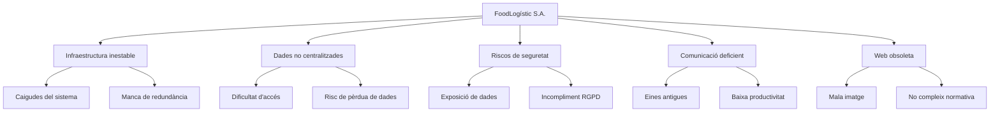
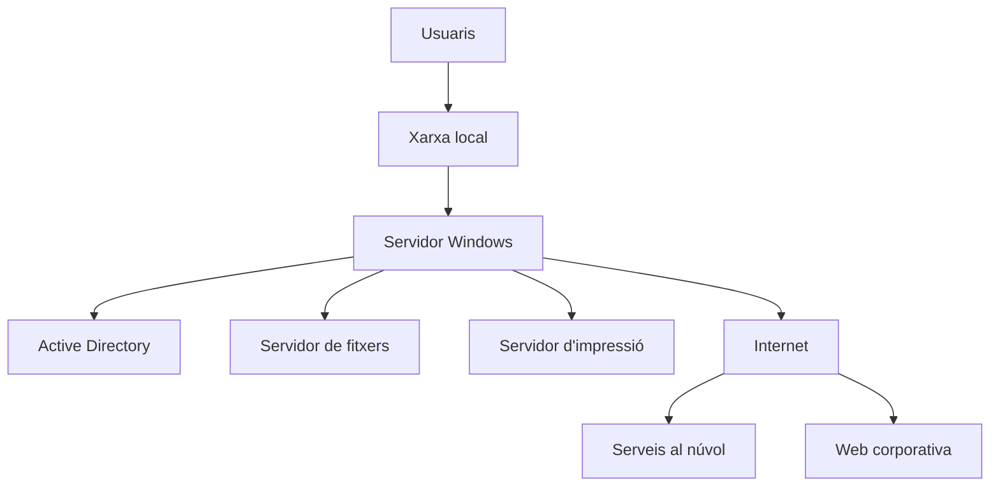
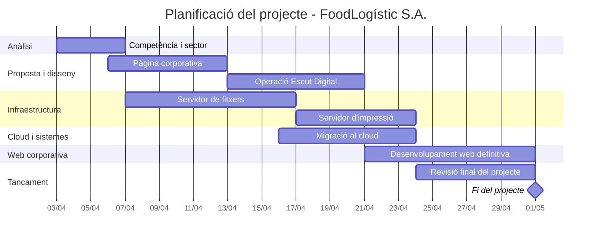

# 📘 P01: Memòria tècnica de la proposta
## FoodLogístic S.A.
###  🎓 SMX 2A 
###  👥 Edu Gordo | Abdeslam Khfif 

---

1. [Introducció](#1--introducció)  
2. [Anàlisi de necessitats](#2--anàlisi-de-necessitats)  
3. [Proposta de solució](#3--proposta-de-solució)  
   - [3.1 Infraestructura](#31-️-infraestructura)  
   - [3.2 Serveis al núvol](#32-️-serveis-al-núvol)  
   - [3.3 Seguretat i LOPD](#33--seguretat-i-lopd)  
   - [3.4 Presència web](#34--presència-web)  
4. [Arquitectura i disseny tècnic](#4--arquitectura-i-disseny-tècnic)  
5. [Pressupost](#5--pressupost)  
6. [Planificació del projecte (Gantt)](#6--planificació-del-projecte-gantt)
7. [Conclusions](#7--Conclusions-del-projecte)  

---

## 1. 📌 Introducció

Aquest projecte s’emmarca en el desenvolupament del *Projecte Intermodular SMX*, en el qual es planteja un cas pràctic basat en una empresa realista: **FoodLogístic S.A.**, una organització del sector alimentari en procés de creixement.

Actualment, l’empresa presenta diverses mancances en la seva infraestructura IT, com ara sistemes inestables, riscos de seguretat, eines de comunicació obsoletes i una presència web desactualitzada. Aquesta situació afecta directament la seva operativa diària i representa un risc per al negoci.

Davant d’aquest escenari, el nostre rol és actuar com una empresa IT professional, analitzant la situació actual i proposant una solució tècnica completa, viable i justificada. Aquesta proposta abasta àrees clau com la infraestructura, els serveis al núvol, la seguretat i la presència web.

La present memòria tècnica té com a objectiu exposar de manera clara, estructurada i visual la solució proposada, permetent al client entendre-la, avaluar-la i prendre decisions informades sobre la seva implementació.

### [Presentació del Projecte](https://gamma.app/docs/Cas-practic-FoodLogistic-SA-jnxl770ev11hp8b?mode=doc)

---

## 2. 🔍 Anàlisi de necessitats

### 📊 Situació actual

FoodLogístic S.A. es troba en un moment de creixement empresarial en què la seva infraestructura IT no ha evolucionat al mateix ritme que el negoci. Aquesta desalineació genera problemes operatius, riscos de seguretat i una pèrdua d’eficiència global.

---

### 🚨 Problemes detectats

| Àrea | Problemàtica | Impacte |
|------|-------------|--------|
| Infraestructura | Sistemes inestables i sense redundància | Interrupcions del servei i pèrdua de productivitat |
| Emmagatzematge | Dades disperses i no centralitzades | Dificultat d’accés i risc de pèrdua d’informació |
| Seguretat | Falta de mesures de protecció adequades | Exposició de dades sensibles |
| Compliment legal | Possible incompliment de LOPD/RGPD | Risc de sancions |
| Comunicació | Eines obsoletes i no integrades | Baixa col·laboració interna |
| Presència web | Web desactualitzada i no adaptada a normativa | Mala imatge corporativa |

---

### 📉 Diagrama de problemàtiques



---

## 3. 💡 Proposta de solució

A partir de l’anàlisi de necessitats realitzat, es proposa una solució tecnològica integral que aborda totes les problemàtiques detectades a FoodLogístic S.A.

La proposta està dissenyada per ser:
- Escalable  
- Segura  
- Eficient  
- Adaptada al creixement de l’empresa  

---

## 3.1 🖥️ Infraestructura

### 🎯 Objectiu
Garantir estabilitat del sistema, alta disponibilitat i centralització dels recursos.

### 🧩 Solució proposada

Implementació d’un entorn basat en **Windows Server amb Active Directory**, que permet la gestió centralitzada de tota la infraestructura.

| Component | Funció |
|----------|-------|
| Active Directory | Gestió d’usuaris i permisos |
| Servidor de fitxers | Emmagatzematge centralitzat |
| Servidor d’impressió | Gestió d’impressores |
| Sistema de backups | Protecció de dades |

---

### ⚙️ Característiques tècniques

- Creació d’usuaris i grups per departaments  
- Assignació de permisos per carpetes  
- Unitats de xarxa compartides  
- Polítiques de seguretat (GPO)  
- Còpies de seguretat periòdiques  

### [Configuració Active Directory](https://github.com/classesSMX2n/projecte-7-edugordo/blob/main/Tasca03/T03.md)

---

## 3.2 ☁️ Serveis al núvol

### 🎯 Objectiu
Modernitzar els serveis i facilitar el treball col·laboratiu i remot.

### 🧩 Solució proposada

Migració parcial de serveis a plataformes cloud com **Google Workspace o Microsoft 365**.

| Servei | Funció |
|-------|------|
| Correu corporatiu | Comunicació professional |
| Emmagatzematge cloud | Accés remot segur |
| Eines col·laboratives | Treball en equip |

---

### ⚙️ Característiques tècniques

- Accés des de qualsevol dispositiu  
- Sincronització automàtica de dades  
- Compartició de documents en temps real  
- Integració amb sistemes locals  

### [Servei del Núvol](https://docs.google.com/presentation/d/1K7kVPVQwis0gtq0M4G6TVWZF5_TkeIZx4bVqsAqAS1g/edit?usp=drive_link)
---

## 3.3 🔐 Seguretat i LOPD

### 🎯 Objectiu
Protegir la informació de l’empresa i garantir el compliment legal.

### 🧩 Solució proposada

Implementació d’un sistema de seguretat basat en control d’accessos, protecció de dades i bones pràctiques.

| Mesura | Descripció |
|-------|----------|
| Control d’accés | Permisos segons rol |
| Polítiques de contrasenya | Seguretat d’usuaris |
| Xifrat de dades | Protecció d’informació |
| Backups | Recuperació davant errors |
| Formació | Conscienciació del personal |

---

### ⚙️ Compliment normatiu

- Adaptació a RGPD/LOPD  
- Gestió de dades personals  
- Consentiment i tractament adequat  
- Registre d’activitats  

---

### [Video 1: Compliment legal en el dia a dia a FoodLogistic](https://drive.google.com/file/d/1KcI_bcUcl7AAptzhryd5jBKTxUZ2nEXP/view?usp=drive_link) 

### [Video 2: Protecció de dades a RRHH i Gestió](https://drive.google.com/file/d/1awwSi5mrLFj7hFrwfdS0l0MI3FwiCOLS/view?usp=drive_link) 


---

## 3.4 🌐 Presència web

### 🎯 Objectiu
Millorar la imatge digital de l’empresa i complir la normativa legal.

### 🧩 Solució proposada

Desenvolupament d’una **nova web corporativa moderna, responsive i legalment adaptada**.

| Element | Funció |
|--------|------|
| Landing page | Presentació de l’empresa |
| Formulari de contacte | Comunicació amb clients |
| Disseny responsive | Adaptació a mòbils |
| Compliment legal | Cookies i privacitat |

---

### ⚙️ Característiques tècniques

- HTML, CSS i estructura clara  
- Navegació intuïtiva  
- Temps de càrrega optimitzat  
- Adaptació a normativa LSSI  

### [Proposta de Pàgina WEB](https://edugordo.github.io/web-corporativaP6/)

---

## 🧠 Justificació global de la solució

La solució proposada respon de manera directa a les necessitats identificades en l’anàlisi inicial, abordant tant les problemàtiques actuals com els requisits futurs de creixement de FoodLogístic S.A.

Des d’un punt de vista tècnic i estratègic, la proposta permet:

- 🔒 **Incrementar el nivell de seguretat**, mitjançant la implementació de polítiques de control d’accés, protecció de dades i compliment de la normativa vigent (RGPD/LOPD).  
- ⚡ **Optimitzar els processos interns**, millorant la disponibilitat dels sistemes i reduint incidències operatives.  
- ☁️ **Adaptar l’entorn de treball a un model modern i flexible**, gràcies a la integració de serveis al núvol que faciliten la mobilitat i la col·laboració.  
- 🌐 **Millorar la imatge corporativa**, a través d’una presència web actualitzada, funcional i alineada amb els requisits legals.

---


A nivell global, es tracta d’una proposta **coherent, viable i escalable**, que equilibra adequadament els costos d’implementació amb els beneficis operatius i estratègics que aporta a l’organització.

👉 Aquesta solució no només resol les mancances actuals, sinó que estableix una base sòlida per al desenvolupament tecnològic futur de l’empresa.

---

## 4. 🧱 Arquitectura i disseny tècnic

### 🌐 Arquitectura actual de la pàgina web

La pàgina web corporativa està formada per una estructura senzilla basada en fitxers HTML. Aquesta arquitectura permet una navegació clara entre la pàgina principal i les pàgines legals necessàries.

La solució es basa en una arquitectura híbrida que integra infraestructura local amb serveis al núvol, garantint centralització, seguretat i escalabilitat.



El sistema permet la gestió centralitzada d’usuaris i recursos mitjançant Active Directory, l’accés a dades compartides i la integració amb serveis cloud per facilitar el treball remot i col·laboratiu.

```text
/docs
├── index.html
├── avis-legal.html
├── politica-cookies.html
└── politica-privacitat.html
```

---

## 6. 💰 Pressupost

Aquest pressupost detalla els costos associats a la implementació de la solució proposada per a FoodLogístic S.A., diferenciant entre el cost inicial d’implantació i els costos recurrents de manteniment i serveis.

---

## 6.1 💸 Cost d’implantació (pagament únic)

Inclou totes les despeses necessàries per posar en marxa la infraestructura i els serveis.

### 🖥️ Maquinari i programari

| Concepte | Descripció | Cost |
|----------|------------|------|
| Servidor | Infraestructura per a serveis interns | 800 € |
| Llicències inicials | Windows Server + CALs | 300 € |

---

### 👨‍🔧 Serveis tècnics (mà d’obra)

Estimació basada en un cost de 15 €/hora per tècnic informàtic.

| Tasca | Hores | Cost |
|------|------|------|
| Configuració infraestructura (AD, fitxers) | 18 h | 270 € |
| Migració serveis al núvol | 8 h | 120 € |
| Desenvolupament web | 10 h | 150 € |
| Vídeo formatiu LOPD | 5 h | 75 € |

---

### 🔐 Altres serveis inicials

| Concepte | Descripció | Cost |
|----------|------------|------|
| Configuració seguretat | Polítiques, permisos i backups | 200 € |

---

### 💰 Total cost d’implantació

**1.915 € (pagament únic)**

---

## 6.2 🔁 Costos recurrents (mensuals / anuals)

Inclou els costos necessaris per mantenir el sistema operatiu i actualitzat.

---

### ☁️ Serveis SaaS

| Concepte | Descripció | Cost |
|----------|------------|------|
| Microsoft 365 / Google Workspace | 10 usuaris x 6 €/mes | 60 €/mes |

---

### 🌐 Hosting i domini

| Concepte | Descripció | Cost |
|----------|------------|------|
| Hosting web | Allotjament de la web corporativa | 8 €/mes |
| Domini web | Registre anual del domini | 15 €/any |

---

### 🛠️ Suport i manteniment

| Servei | Descripció | Cost |
|--------|------------|------|
| Manteniment preventiu | Backups, actualitzacions i revisions | 50 €/mes |
| Suport tècnic | Resolució d’incidències | Inclòs |

---

### 💰 Total costos recurrents

- **118 €/mes**
- **+ 15 €/any (domini)**

---

## 6. 📅 Planificació del projecte (Gantt)

La següent planificació mostra les fases del projecte i la seva distribució temporal aproximada.



---

## 7. 📌 Conclusions del projecte

Aquest projecte ens ha permès simular el treball real que es fa quan una empresa té problemes tecnològics i necessita una solució professional. Hem passat per totes les fases del procés: analitzar la situació, pensar una proposta, dissenyar-la i documentar-la de manera ordenada.

També hem pogut entendre millor com es treballa en equip i com és important seguir un ordre lògic a l’hora de prendre decisions i justificar-les. No es tracta només de “fer tecnologia”, sinó de saber explicar-la i adaptar-la a les necessitats d’un client.

En general, el projecte ens ha ajudat a veure com seria treballar en un entorn real d’empresa IT i quina importància té la planificació i la comunicació en aquest tipus de feines.

---
