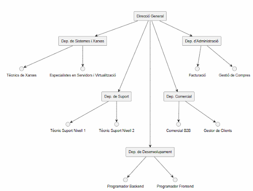

# Proposta tècnica – Anàlisi del sector i estratègia

## Fase 1 – Coneixent el terreny i la competència

### 1. Recerca de mercat: empreses de serveis informàtics al Maresme

Per poder posicionar la nostra futura empresa de serveis informàtics a Mataró, s’ha realitzat un petit estudi de mercat analitzant empreses reals del sector que operen a la mateixa zona geogràfica. A continuació es descriuen tres competidors directes, tots ells ubicats a la ciutat de Mataró.

---

### 1. Digitalnet – Serveis i manteniments informàtics
**Ubicació:** Mataró  
**Web:** http://www.digitalnet.cat/  
**Mida de l’empresa:** PIME  

**Serveis principals:**
Suport tècnic i manteniment informàtic  
Gestió de maquinari i xarxes  
Servidors i sistemes  
Solucions d’impressió  
Assessorament IT a empreses  

Digitalnet és una empresa consolidada amb més de 20 anys d’experiència i un ampli catàleg de serveis. Està orientada principalment a empreses i ofereix solucions integrals de manteniment i infraestructura, fet que la posiciona com un competidor fort dins del sector.

---

### 2. SISTICAT
**Ubicació:** Mataró  
**Web:** https://sisticat.cat/  
**Mida de l’empresa:** Microempresa  

**Serveis principals:**
Reparació i manteniment d’equips informàtics  
Suport tècnic  
Instal·lació i manteniment de xarxes  

SISTICAT és una empresa de dimensions reduïdes que ofereix serveis informàtics bàsics, principalment enfocats a manteniment i suport tècnic. El seu model es basa en la proximitat amb el client i l’atenció personalitzada.

---

### 3. Extreme Micro
**Ubicació:** Mataró  
**Web:** https://www.extrememicro.com/  
**Mida de l’empresa:** Microempresa  

**Serveis principals:**
Reparació d’ordinadors  
Seguretat informàtica  
Recuperació de dades  

Extreme Micro se centra sobretot en serveis tècnics especialitzats, com la recuperació de dades i la seguretat informàtica. Té un enfocament orientat a la resolució de problemes concrets per a particulars i petites empreses.

---

### Conclusions de la recerca de mercat

L’anàlisi de la competència mostra que a Mataró hi ha tant microempreses com PIMEs dedicades als serveis informàtics. Les PIMEs ofereixen solucions globals per a empreses mitjanes, mentre que les microempreses aposten per serveis més específics i una atenció més propera. Aquest context fa necessari diferenciar-se mitjançant qualitat del servei, organització interna i proximitat amb el client.

---

## 2. Organigrama de l’empresa

L’organigrama següent mostra una estructura tipus d’una empresa de serveis informàtics orientada a clients empresarials.

### Codi PlantUML

plantuml
@startuml

rectangle "Direcció General" as DG

rectangle "Dep. de Sistemes i Xarxes" as SYS
rectangle "Dep. de Suport" as HELP
rectangle "Dep. de Desenvolupament" as DEV
rectangle "Dep. Comercial" as COM
rectangle "Dep. d'Administració" as ADM

DG -down-> SYS
DG -down--> HELP
DG -down----> DEV
DG -down--> COM
DG -down-> ADM

SYS --> "Tècnics de Xarxes"
SYS --> "Especialistes en Servidors i Virtualització"

HELP --> "Tècnic Suport Nivell 1"
HELP --> "Tècnic Suport Nivell 2"

DEV --> "Programador Backend"
DEV --> "Programador Frontend"

COM --> "Comercial B2B"
COM --> "Gestor de Clients"

ADM --> "Facturació"
ADM --> "Gestió de Compres"

@enduml

## 3. Descripció dels departaments

### Direcció General
Defineix l’estratègia de l’empresa  
Pren les decisions principals  
Coordina els departaments  
Manté la relació amb clients clau  

**Perfils:**  
Direcció / Gerència  

---

### Departament de Sistemes i Xarxes
Gestió de la infraestructura tecnològica  
Xarxes, servidors i seguretat  
Manteniment i disponibilitat dels sistemes  

**Perfils:**  
Tècnics de Xarxes  
Especialistes en Servidors i Virtualització  

---

### Departament de Suport (Helpdesk)
Atenció d’incidències  
Suport als usuaris  
Resolució de problemes tècnics  

**Perfils:**  
Tècnic de Suport Nivell 1  
Tècnic de Suport Nivell 2  

---

### Departament Comercial
Captació i seguiment de clients  
Elaboració de pressupostos  
Coordinació de serveis  

**Perfils:**  
Comercial B2B  
Gestor de Clients  

---

### Departament d’Administració
Gestió econòmica i administrativa  
Relació amb proveïdors  
Control documental  

**Perfils:**  
Facturació  
Gestió de Compres  

---

### Departament de Desenvolupament
Desenvolupament de software a mida  
Manteniment d’aplicacions  

**Perfils:**  
Programador Backend  
Programador Frontend  

---

## Fase 2 – Estratègia

### Proposta de valor
La nostra estratègia es basa en la proximitat i la rapidesa de resposta. En ser una empresa local de Mataró, podem oferir un tracte proper i una atenció més directa que empreses de major dimensió.

Apostem per un servei integral, assumint tant el suport del dia a dia com la gestió de sistemes, xarxes i possibles millores futures. També prioritzem la flexibilitat, adaptant-nos a les necessitats reals del client i evitant costos innecessaris.

---

### Recursos necessaris
Per donar servei a un client com **FoodLogístic S.A.**, es considera necessari el següent equip bàsic:

Direcció / coordinació del servei  
1 tècnic de sistemes i xarxes  
2 tècnics de suport (nivell 1 i nivell 2)  
1 persona de gestió comercial i clients  
Suport administratiu (parcial)  

Amb aquest equip inicial es pot oferir un servei estable i de qualitat. En cas d’un augment del volum de feina o de noves necessitats, es valoraria la incorporació de més personal.
