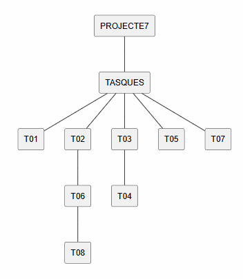
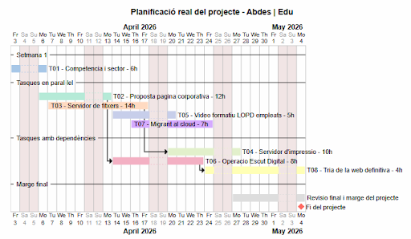

# 📊 Fase 1: Anàlisi real del projecte (pensament estructural)

## 1.1 Identificació de tasques i dependències

A partir de les tasques del projecte (T01–T08), es realitza una anàlisi per identificar l’ordre lògic d’execució, les possibles execucions en paral·lel i les dependències entre tasques.

### 🔄 Ordre lògic d’execució

L’ordre del projecte no és completament lineal, però sí que hi ha una seqüència base:

**T01: Coneixent la competència i el sector** → punt de partida per entendre el context  
**T02: Creant la proposta de pàgina corporativa** → base per a tasques web posteriors  
**T03: Servidor de fitxers** → infraestructura interna  
**T04: Servidor d’impressió** → depèn de T03  
**T05: Vídeo formatiu LOPD empleats** → independent  
**T06: Operació Escut Digital** → depèn de T02  
**T07: Migrant al cloud** → pot executar-se en paral·lel amb altres tasques  
**T08: Tria de la web definitiva** → depèn de T06  

### ⚡ Tasques que poden anar en paral·lel

Algunes tasques no tenen dependències directes i es poden executar simultàniament:

T01: Coneixent la competència i el sector  
T02: Creant la proposta de pàgina corporativa  
T03: Servidor de fitxers  
T05: Vídeo formatiu LOPD empleats  
T07: Migrant al cloud  

Això permet optimitzar el temps global del projecte.

### ⛔ Tasques bloquejants (dependències crítiques)

Hi ha tasques que no poden començar fins que altres s’hagin completat:

**T04: Servidor d’impressió** → depèn de T03  
**T06: Operació Escut Digital** → depèn de T02  
**T08: Tria de la web definitiva** → depèn de T06 (i indirectament de T02)  

### 🚧 Colls d’ampolla

Els possibles colls d’ampolla del projecte poden aparèixer en:

T02 → T06 → T08 (cadena de dependència crítica)
T03 i T04 (per la seva complexitat tècnica i durada)

Si aquestes tasques s’endarrereixen, poden afectar el conjunt del projecte.

### 🔥 Tasques més crítiques

Les tasques amb més impacte sobre el projecte són:

T03: Servidor de fitxers  
T04: Servidor d’impressió  

Són les més pesades tècnicament i poden generar retards globals.

---

## 1.2 Identificació del camí crític

### ⏱️ Tasques que afecten tot el projecte si es retarden

**T02: Creant la proposta de pàgina corporativa**

Aquesta tasca és clau perquè:
Serveix de base per a T06  
Condiciona T08  
Impacta directament en la planificació final del projecte  

### 🟢 Tasques amb marge (slack)

T03: Servidor de fitxers  
T04: Servidor d’impressió  

Aquestes tasques tenen més flexibilitat perquè:
No bloquegen directament la resta del projecte  
Disposen de marge temporal per a la seva execució  

---

## 🧠 Reflexió final

No es tracta només d’identificar el camí crític, sinó d’entendre’l.

Aquest anàlisi permet:
Prioritzar correctament les tasques  
Detectar riscos abans que apareguin  
Optimitzar temps i recursos  
Evitar bloquejos en cadena  

Una bona planificació en aquesta fase és clau per garantir l’èxit del projecte.

## 📊 Estimació d’hores per tasca

### T01: Coneixent la competència i el sector → **6 hores**
Comprensió: 1h  
Recerca: 2h  
Anàlisi: 1h  
Documentació: 1h  
Marges i interrupcions: 1h  

---

### T02: Creant la proposta de pàgina corporativa → **12 hores**
Comprensió: 1h  
Recerca (referències web): 2h  
Implementació: 5h  
Proves i ajustos: 2h  
Documentació: 1h  
Coordinació + marge: 1h  

---

### T03: Servidor de fitxers → **14 hores**
Comprensió: 2h  
Recerca tècnica: 3h  
Implementació: 5h  
Proves i errors: 2h  
Documentació: 1h  
Marges: 1h  

---

### T04: Servidor d’impressió → **10 hores**
Comprensió: 1h  
Recerca: 2h  
Implementació: 4h  
Proves: 1h  
Documentació: 1h  
Marges: 1h  

---

### T05: Vídeo formatiu LOPD empleats → **5 hores**
Guió i comprensió: 1h  
Preparació contingut: 2h  
Producció vídeo: 1h  
Edició: 1h  

---

### T06: Operació Escut Digital → **8 hores**
Anàlisi legal: 2h  
Adaptació web: 3h  
Implementació: 2h  
Revisió: 1h  

---

### T07: Migrant al cloud → **7 hores**
Recerca: 2h  
Configuració: 3h  
Proves: 1h  
Documentació: 1h  

---

### T08: Tria de la web definitiva → **4 hores**
Comparació opcions: 2h  
Decisió i justificació: 1h  
Documentació final: 1h  

---

## 🧠 Reflexió final

L’estimació d’hores no depèn només de la tasca visible, sinó de totes les fases ocultes del procés.

L’objectiu d’aquesta fase és:
Planificar amb realisme  
Evitar infraestimacions  
Detectar tasques costoses abans d’executar-les  
Millorar la gestió global del projecte  

Una bona estimació és clau per a una execució eficient del projecte.

# 👥 Fase 3: Assignació de recursos (treball en equip real)

En aquesta fase es distribueixen les tasques del projecte entre els membres de l’equip, tenint en compte les dependències, la càrrega de treball i l’optimització del temps.

Els membres de l’equip són:
**Edu Gordo**
**Abdeslam**

---

## 🎯 Objectius de la distribució

Evitar sobrecàrrega d’un membre
Minimitzar temps morts
Respectar dependències entre tasques
Permetre treball en paral·lel
Garantir coordinació en tasques compartides

---

## 🤝 Tasques individuals (treball conjunt obligatori)

Les següents tasques són **individuals en el sentit d’execució**, però es realitzen **de manera conjunta pels dos membres**:

**T01: Coneixent la competència i el sector**
**T02: Creant la proposta de pàgina corporativa**
**T03: Servidor de fitxers**
**T04: Servidor d’impressió**
**T06: Operació Escut Digital**

👉 Justificació:
Són tasques clau del projecte que requereixen implicació dels dos membres
Permeten millor coordinació i revisió conjunta
Eviten errors i milloren la qualitat final
Es treballa en paral·lel dins la mateixa tasca

---

## 🤝 Tasques compartides (col·laboratives)

### 🔄 T05: Vídeo formatiu LOPD empleats
Edu Gordo → gravació, edició i suport tècnic
Abdeslam → guió, contingut i estructura

👉 Combina contingut i producció audiovisual

---

### ☁️ T07: Migrant al cloud (presentació de serveis de mail i cloud)
Treball completament conjunt  
Investigació i selecció de serveis de correu electrònic i cloud (Google Workspace, Microsoft 365, etc.)  
Preparació de la presentació dels serveis i les seves funcionalitats  
Anàlisi de pros i contres de cada solució  
Validació conjunta del servei més adequat per a l’empresa  

👉 Tasca orientada a la presentació i justificació de serveis cloud i de correu corporatiu

👉 Tasca tècnica crítica que requereix coordinació constant

---

### 🌐 T08: Tria de la web definitiva
Decisió conjunta
Anàlisi dels resultats de T06
Comparació d’opcions
Consens final

👉 Tasca estratègica de decisió final

---

## 🔗 Dependències entre membres

No hi ha separació rígida de responsabilitats en les tasques principals
Totes les tasques clau es treballen de manera conjunta
Això evita dependències personals i bloquejos entre membres

---

## ⚖️ Equilibri de càrrega

En aquest model de treball:

Tots dos membres participen en les tasques principals (T01, T02, T03, T04, T06)
Les tasques compartides (T05, T07, T08) reforcen la coordinació
Es garanteix equitat en la participació
Es redueixen riscos de sobrecàrrega individual

---

## 🚫 Evitació de problemes

### S’ha evitat:
Assignacions rígides que bloquegin dependències
Sobrecàrrega individual d’un membre
Separació excessiva que pugui generar temps morts

### S’ha garantit:
Treball col·laboratiu real
Coordinació contínua
Revisió conjunta de totes les decisions importants

---

## 🧠 Reflexió final

Aquest model de treball prioritza la col·laboració per sobre de la divisió estricta de tasques.

Això permet:
Millor qualitat en les entregues
Menys errors
Més coordinació
Un flux de treball més estable i eficient

En projectes tècnics, treballar conjuntament en les fases clau redueix riscos i millora el resultat final.

---

# 📅 Fase 4: Construcció del diagrama de Gantt (UMLTree)

Utilitzant PlantUML (UMLTree), es representa la planificació temporal del projecte.

El diagrama ha de mostrar:

Tasques del projecte (T01–T08)
Durada de cada tasca
Dependències entre tasques
Execució en paral·lel
Visió temporal de les 3 setmanes

# ❓ Preguntes clau del projecte (reflexió obligatòria)

## 🧩 Quina és la tasca més crítica del projecte i per què?

La tasca més crítica és **T02: Creant la proposta de pàgina corporativa**, ja que és la base de tot el desenvolupament web posterior.

A partir d’aquesta tasca depenen:
T06 (Operació Escut Digital)
T08 (Tria de la web definitiva)

Si T02 falla o es retarda, afecta directament la resta del flux del projecte.

---

## 🚧 On heu detectat el principal coll d’ampolla?

El principal coll d’ampolla es troba a la cadena:

**T02 → T06 → T08**

Aquest bloc és crític perquè:
Té dependència directa entre tasques
Condiciona decisions estratègiques finals
No permet paral·lelisme real entre aquestes fases

---

## 🤔 Quina decisió de planificació ha estat més difícil?

La decisió més difícil ha estat equilibrar:

el treball individual de les tasques tècniques (T03 i T04)
amb les tasques estratègiques i web (T02 i T06)

També ha estat complex decidir com coordinar les tasques compartides (T05, T07 i T08) sense generar bloquejos.

---

## 📊 Heu hagut de modificar alguna estimació inicial? Per què?

Sí, algunes estimacions s’han ajustat perquè:

S’ha detectat que les tasques inclouen més fases ocultes (proves i errors)
La coordinació entre membres afegeix temps extra no previst inicialment
Algunes tasques tècniques (T03 i T04) poden requerir més temps de debugging del previst

---

## ⚠️ Quin risc podria fer fracassar el projecte?

El risc principal és:

**Retard en T02**, ja que bloqueja T06 i T08

Altres riscos importants:
Errors en la configuració de servidors (T03 i T04)
Mala coordinació en tasques compartides (T05, T07 i T08)

---

## ⏳ Si tinguéssiu una setmana més, què canviaríeu?

Amb una setmana addicional es podria:

Completar amb més criteri T03 i T04
Fer una web més professional i completa
Afegir més documentació i validació final del projecte

També permetria reduir riscos i millorar la qualitat global del resultat final.
